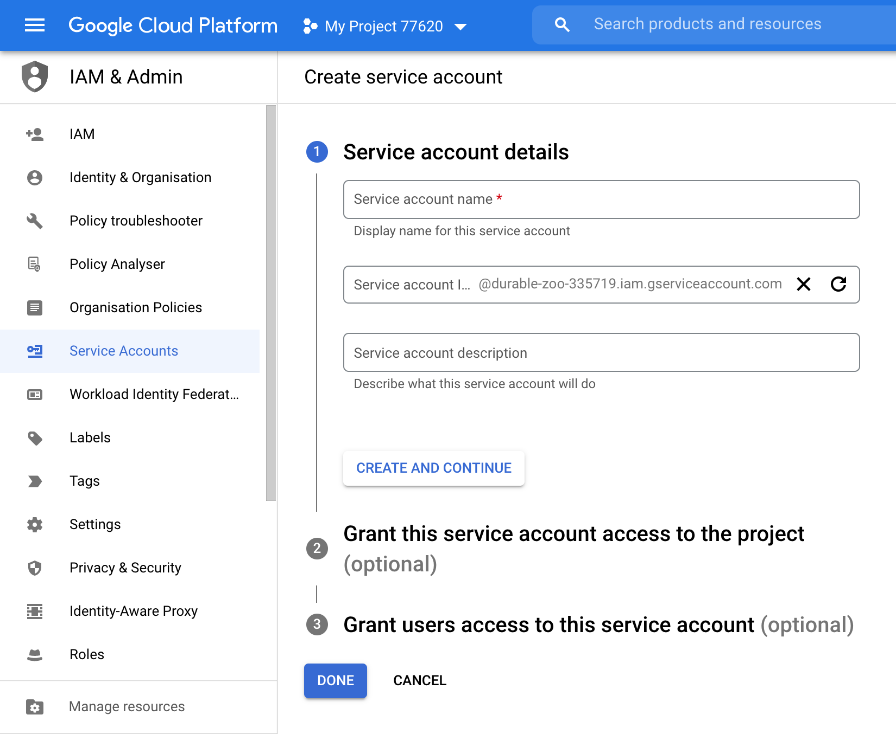
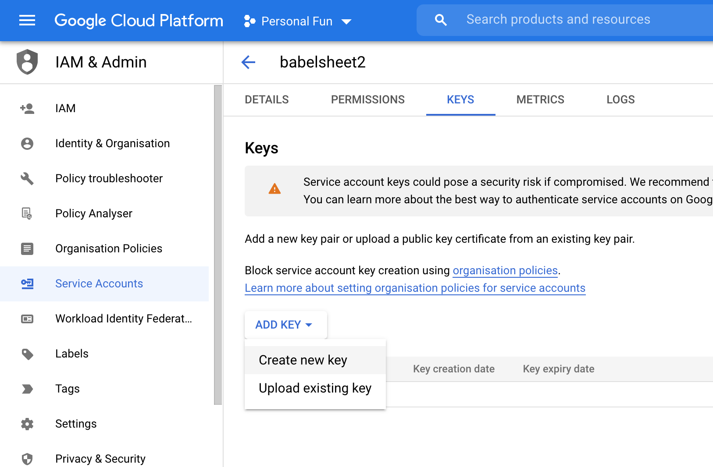
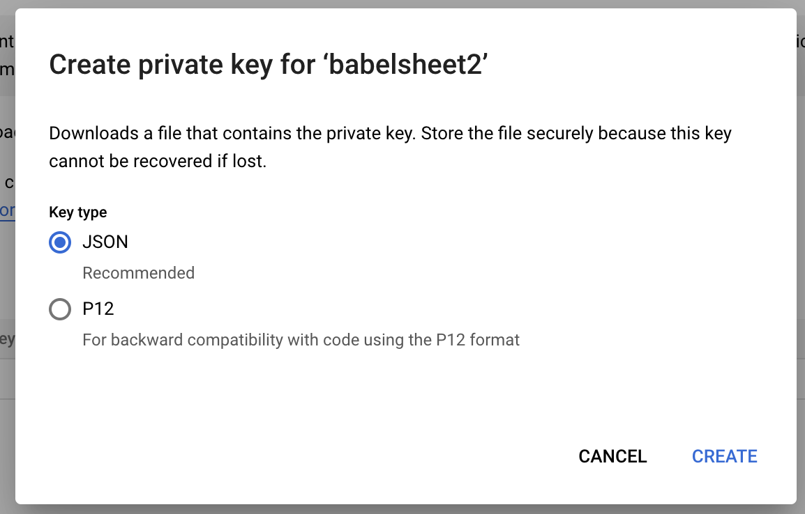

# Babelsheet2

🇬🇧 🇪🇸 🇫🇷 🇩🇪 🇵🇱 🇨🇳

Babelsheet2 is a tool that addresses one of the biggest [i18n](https://en.wikipedia.org/wiki/Internationalization_and_localization) issue. Namely, it provides frictionless way
of cooperation between language translators and developers.

## 💡 How it works?

Babelsheet2 uses Google Spreadsheets for translations single source of truth because it is an acceptable tool 
for non-technical people (Excel-like tools are pretty common and have low entry threshold). The spreadsheet
has some structure where part of it is filled by the developer and the other part is to be completed by
the language translator.

The structure of the spreadsheet has been explained well [in the primary Babelsheet project](https://github.com/TheSoftwareHouse/babelsheet/blob/master/README.md#markup) that this one is based on.

Then, to include these translations in the app, Babelsheet2 provides some API
that is able to fetch, parse and write translations defined in the spreadsheet 
into your file system in the format you want.

## 🤔 Why "2"?

This project is based on [babelsheet](https://github.com/TheSoftwareHouse/babelsheet) and [babelsheet-js](https://github.com/TheSoftwareHouse/babelsheet-js) projects idea, 
which is a very cool. However, the implementation of that idea
taught us some lessons that some things can be done better. Hence, we release version 2 with a bit 
different approach that should solve some problems that were hard to be solved in the primary version.

## 🧰 Prerequisites

Before you begin the setup of the Babelsheet2, you need to create a Google Service Account, so
Babelsheet2 will be able to perform some actions on Google Services in your behalf.

To do that, go to your [Google Cloud Platform's Dashboard](https://console.cloud.google.com/) first. If you are using it for 
the first time, you may have to create your first Project there to be able to perform any actions. 
So, select some existing project in which scope you would like to store the translations, or create a new one.


Then [create service account](https://console.cloud.google.com/iam-admin/serviceaccounts/create) in that project's scope.
You can name it however you want. In terms of the account access setup, you don't need to add any role for this account so
just click "Continue" button on this step. Also, the other "Grant users access to this service account" step is optional too.



When you create the service account, open its details manager by clicking its e-mail from the list.
Then generate new JSON-format credentials like follows:

1. Open "KEYS" tab
2. Click "ADD KEY" drop down 
3. Select "Create new key"
4. Make sure that "JSON" format is selected in the dialog that popped up 
5. Click "CREATE"
6. Save the downloaded file in your project's root directory and name it `.credentials.json`
7. Although the created service account does not have too much permissions, 
   it's recommended that you add this file to `.gitignore` in your project and distribute it
   among the developers that are involved in your project in other way.
   

## 🔧 Installation

### npx way

If you have `npx` installed, you can run the following command to initialize the Babelsheet2
in your project directory:

```bash
npx babelsheet2 init
```

### Global way

Alternatively, if you don't have `npx` you can install Babelsheet2 CLI tool globally:

```bash
npm i -G babelsheet2
```

...and then you should be able to execute following command whenever you want to set up Babelsheet2 
for some of your projects:

```bash
babelsheet2 init
```

### Next steps

The Babelsheet2 CLI leads you by hand during init process. It will share the spreadsheet file (on the e-mail and as a link in the console output) with you
where you can fill first translation keys. The next thing that you will probably need is
to share that spreadsheet with language translators, and the developers that work on the same project.
Also, as mentioned in the "Prerequisites" section above, you may need to share the `.credentials.json` file
with the developers so they are able to run the translation fetching script.

If everything has been set up correctly, you should be able to run the translation fetching script for instance like this
(it depends on the configuration):

```bash
npm run translations
```

...and this will update the translation files each time you run it basing on the Google Spreadsheet file content.

### Comment on further automation

You may want to execute this script during the build process or for instance on some CI. This is doable,
however we recommend you to execute the translations fetching script manually to be able to perform last check
of translations if they are ok before committing them into the repository. This way you may avoid a risk of 
deployment of some mistake straight ahead into production environment. Remember, the mistakes happen, especially
when non-technical people are involved in the process. They may for instance edit the wrong cell 
and break the translation files structure unintentionally by doing so.

## 💎 Core values

This project has some goals that we would like to keep in mind during the development process.
They are listed below.

### 🔗 Reduced dependencies

Too much dependencies may result not only a big `node_modules` directory,
but also may affect negatively on maintainability of the project. 
The more dependencies you have, the higher the probability of problems with dependency updates.

Hence, we don't want this tool to handle every file format on the world out-of-the-box.
Instead, every package should have single responsibility and use only the dependencies
that are crucial to make it work.

### 👨‍💻 Developer Experience

Everything that is a monotonous task and could be automated,
should be automated. Hence, there is a CLI command
that enables a developer to set up their project for translations
easily by asking a couple of questions. It is able to generate the
spreadsheet, share it with you and registers the 
translation fetching script in your project.

### 🔧 Customization

No matter how much use cases your solution covers, there will be always
 that project that your clever tool mechanisms do not fit at all to. 
That's the reason why Babelsheet2 shares an API that enables you to write
custom script for translation files generation.

### ♟️ Reasonable defaults

Too much customizability may result with overwhelming and time consuming
process of setup. Hence, for beginner users there should be a simpler way
where they don't have to configure every tiny aspect. In Babelsheet2
there are default settings predefined that enable to start
working with the tool in a fast and straightforward manner.

### 🥳 Emojis

The days when console output had to be monotonous text are long gone.
It can be decorated a bit with emojis to improve readability and fun 😉